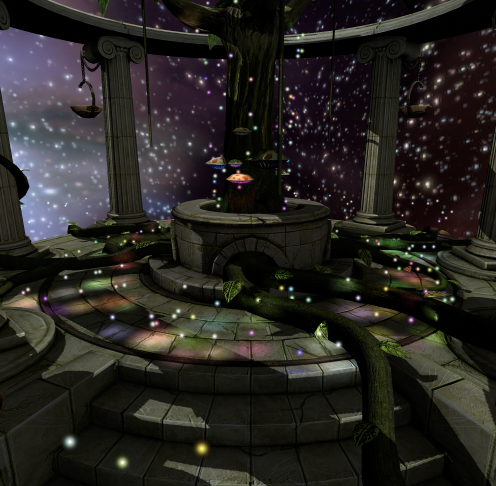
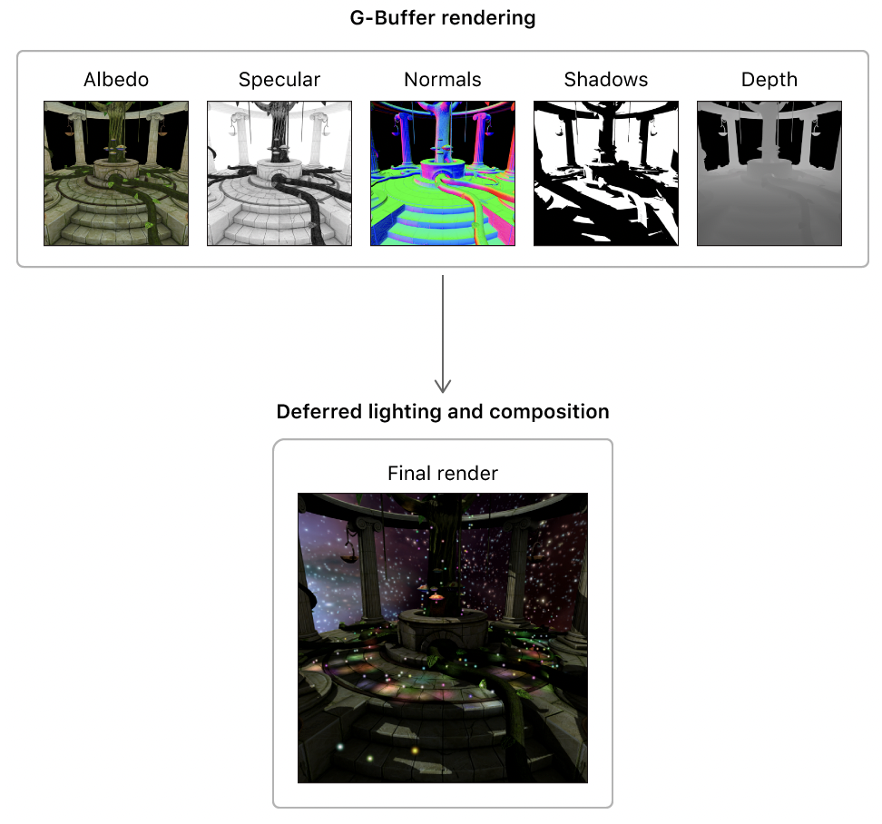
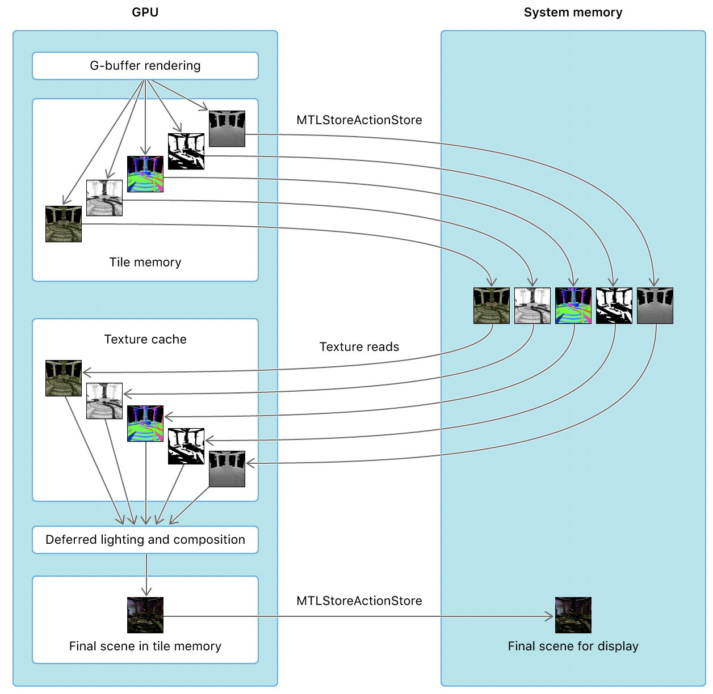
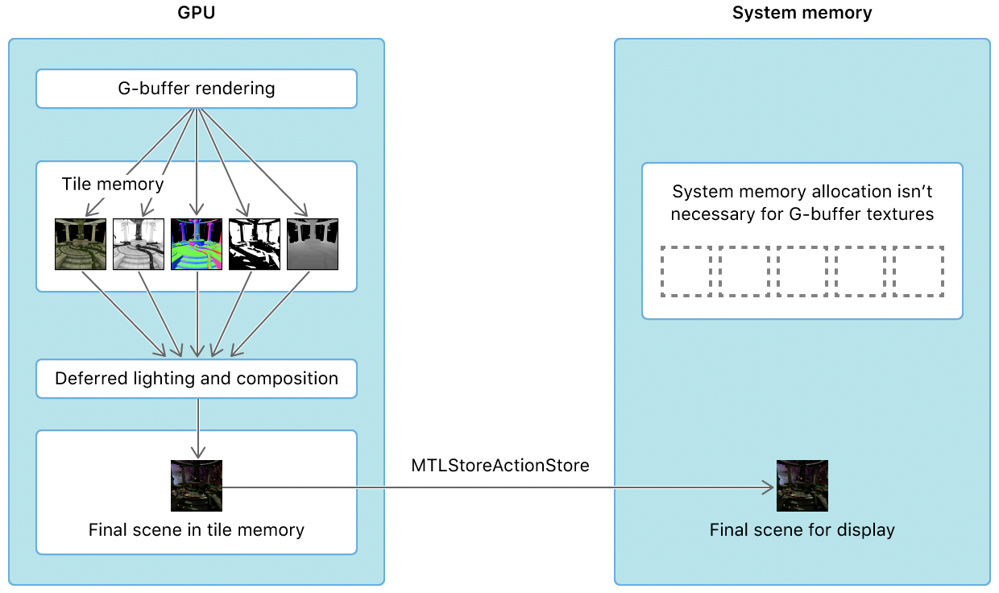
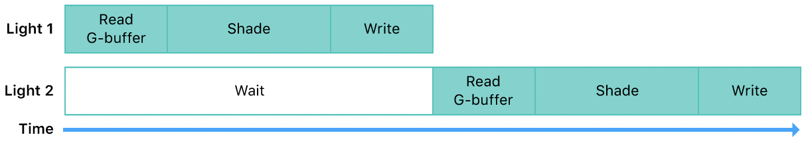
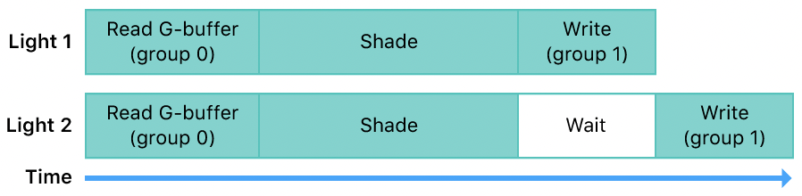
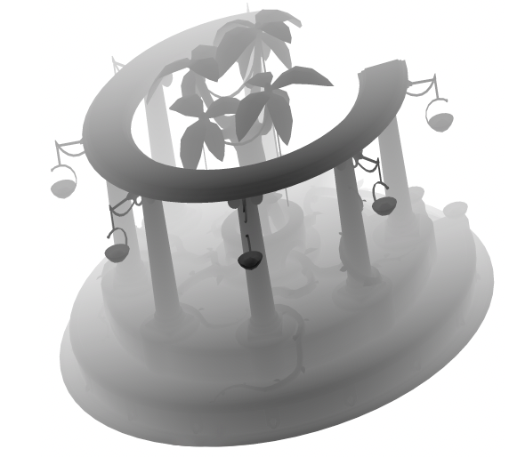
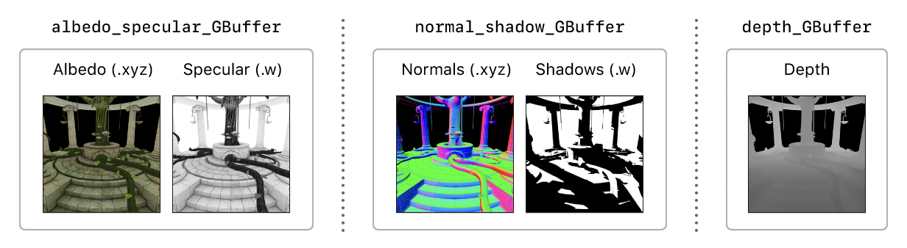
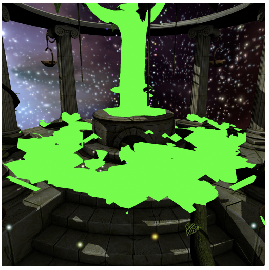
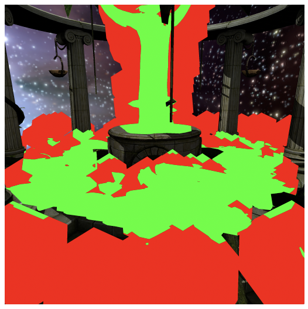

# 2022-03-29 Rendering a Scene with Deferre

Tile-based模式的GPU光照的计算是非常消耗计算资源的，为了减少光照的重复计算，通过实施延时光照渲染来进行优化。

# 概述

通过Apple例子来看一下延时光照渲染实施方法，这个例子应用shadow map（阴影贴图）实现阴影，并使用模版缓冲区剔除光量。



与 Forward lighting相比，Deferred lighting可以渲染大量的灯光数量。比如，在Forward lighting模式下，如果场景中有很多光源，无法对每个光源在每个片元上作用的计算量进行全量计算。需要应用到复杂的排序和像素合并算法来筛除对每个片元能产生作用的光源来限制计算量。使用Deferred lighting，可以容易地将多个光源应用到场景中。

# 重要概念

在开始解读示例代码的之前，回顾一下以下概念可以更好的理解关键细节。

## 传统延时光照渲染

传统延时光照渲染通常分为两个渲染通道：

- 第一个渲染通道：G-buffer 渲染。渲染器绘制和变换场景里的模型，片元函数将渲染结果输出到 "几何缓冲区" 和 "G-Buffer"中。G-Buffer包含了模型的材料颜色信息，以及每个片元的法线、阴影和深度信息。
- 第二个渲染通道：延时光照和构图。渲染器绘制每个光柱，使用G-Buffer中的数据重建每个片元的位置信息并应用光照计算。绘制光源时，该光源输出为混合前一个光源的输出后的结果。最后，渲染器将其他数据（如阴影和定向光照）合成到场景中。



一些macOS的GPU是"即时渲染"（IMR）架构。IMR GPU延时光照只能通过两个渲染通道实现。所以这个例子的macOS版本实现了两个通道的延时光照算法。

## Apple芯片GPU上的单通道延时光照

Apple芯片GPU使用了基于磁贴分片的延迟渲染（TBDR）架构，TBDR架构在GPU内部专门为第一块磁贴设计了内存来存储渲染数据。渲染结果存储到磁贴内存中，可以避免数据在GPU和系统内存中所花费的大量资源消耗，GPU和系统内存DDR是通过带宽受限的内存总线交换数据。GPU什么时候需要将磁贴内存写入到系统内存取决于以下配置情况：

- 应用程序主动执行了存储命令
- 应用程序纹理的存储模式
将 "MTLStoreAction.store"设置为存储操作时，渲染通道中的渲染目标的输出数据将从磁贴内存中写入系统内存。如果这些数据将用于后续的渲染通道，这些纹理将做为输入数据从系统内存中读入到GPU的纹理缓存中。因此，传统的延时光照渲染器要求第一次和第二次渲染通道之间将G-Buffer数据存储在系统内存中。

由于TBDR架构允许在任何时间从磁贴内存中读取数据。这允许片元着色器从磁贴内存中读取数据并对渲染目标进行计算，然后将数据再次写入磁贴内存。这个特性避免了在第一次和第二次渲染通道之间将G-Buffer数据存储到系统内存中。所以，TBDR架构下延迟光照渲染器可以通过单个渲染通道实现。
G- Buffer在单个渲染通道由GPU（而不是CPU）生成和使用。因此，在渲染通道开始之前，不会从系统内存中加载数据，也不会在渲染通道完成后将结果存储在系统内存中。光照片元函数不是从系统内存中的纹理读取G-Buffer数据，而是从G-Buffer读取数据，同时它仍然作为渲染目标附加到渲染通道。因此，不需要为G-Buffer纹理分配系统内存，可以使用MTLStorageMode.memoryless存储模式声明这些纹理。


允许TBDR GPU从片元函数中附加的渲染目标读取数据的特性称为"可编程混合"
## 具有栅格顺序组的延时光照
默认情况下，当片元着色器将数据写入像素时，GPU会等到着色程序完全完成对该像素的写入后，再开始为同一个像素执行另一个片元着色程序。


栅格顺序组允许应用程序增加GPU片元着色器的并行化。使用栅格顺序组，片元函数可以将渲染目标分隔到不同的执行组中。这种分离执行允许GPU在片元着色器的上一个实例完成时将数据写入另一个组的像素之前，读取一个组中的渲染目标并对其执行计算。


在示例程序中，一些光照片元函数使用了栅格顺序组：
- Raster order group 0. "AAPLLightingROG" 用于包含光照计算结果的渲染目标
- Raster order group 1. "AAPLGBufferROG" 用于光照函数中G-Buffer数据。

这些栅格顺序组允许GPU在上一个片元着色器完成光照计算并写入输出数据之前读取片元着色器中的G-Buffer并执行光照计算。

## 渲染延时光照帧

这个示例通过以下阶段来显示完整帧：

1. 阴影贴图
2. G-Buffer
3. 定向光
4. 光蒙板
5. 点光源
6. 天空盒
7. 彩色小灯

示例的单通道延时渲染器生成G-Buffer并在单个渲染通道中执行所有后续阶段。由于IOS和tvOS的GPU是TBDR架构，单通道实现允许设备从磁贴内存中的渲染目标读取G-Buffer数据。

```Swift
encodePass(into: commandBuffer, 
           using: gBufferAndLightingPassDescriptor, 
           label: "GBuffer & Lighting Pass") { renderEncoder in
    
    encodeGBufferStage(using: renderEncoder)
    encodeDirectionalLightingStage(using: renderEncoder)
    encodeLightMaskStage(using: renderEncoder)
    encodePointLightStage(using: renderEncoder)
    encodeSkyboxStage(using: renderEncoder)
    encodeFairyBillboardStage(using: renderEncoder)
}
```


示例程序的传统延时渲染在一个渲染通道中生成G-Buffer，然后在另一个渲染通道中执行后续

```Swift
encodePass(into: commandBuffer,
           using: gBufferPassDescriptor,
           label: "GBuffer Generation Pass") { renderEncoder in

    encodeGBufferStage(using: renderEncoder)
}
```


```Swift
encodePass(into: commandBuffer,
           using: lightingPassDescriptor,
           label: "Lighting Pass") { (renderEncoder) in
            
    encodeDirectionalLightingStage(using: renderEncoder)
    encodeLightMaskStage(using: renderEncoder)
    encodePointLightStage(using: renderEncoder)
    encodeSkyboxStage(using: renderEncoder)
    encodeFairyBillboardStage(using: renderEncoder)
}
```


## 渲染阴影贴图

示例程序通过从光源的透视渲染模型，为场景中的单个定向光源（太阳）渲染阴影贴图。



阴影贴图的渲染管线有顶点函数，但是没有片元函数。因此，这个示例程序无需执行渲染管线的后续阶段就可确定写入阴影贴图的屏幕空间深度值。渲染器执行由于没有片元函数，因此执行很快。

```Swift
lazy var shadowGeneration = makeRenderPipelineState(label: "Shadow Generation Stage") { descriptor in
    descriptor.vertexFunction = library.makeFunction(name: "shadow_vertex")
    descriptor.depthAttachmentPixelFormat = .depth32Float
}
```


在为阴影贴图绘制几何图形之前，该示例程序设置了深度偏差值以减少阴影伪影：

```Swift
renderEncoder.setDepthBias(0.015, slopeScale: 7, clamp: 0.02)
```


然后，在片元函数的G-Buffer阶段，示例程序判断片元是否被遮挡或被阴影遮罩。

```C++
// Compare the depth value in the shadow map to the depth value of the fragment in the sun's.
// frame of reference.  If the sample is occluded, it will be zero.
float shadow_sample = shadowMap.sample_compare(shadowSampler, in.shadow_coord.xy, in.shadow_coord.z);
```


示例程序将sample_compare函数的结果存储在 normal_shadow的渲染目标的"W"组件中

```C++
gBuffer.normal_shadow = half4(eye_normal.xyz, shadow_sample);
```


在定向光和点光源合成阶段，示例程序从G-Buffer中读取阴影值并应用到片元上。

## 渲染G-Buffer

示例程序包含以下纹理：

- albedoSpecular：存储反射率和镜面反射数据，反射数据存储在"x", "y",和"z"分量中，镜面反射数据存储在"w"分量中。
- normalShadow：存储法线和阴影数据。法线数据存储在 "x", "y"和"z"分量中，阴影数据存储在"w"分量中。
- depth：存储视野空间的深度信息值。



示例程序渲染G-Buffer，传统渲染器和单通道延时渲染器都将所有G-Buffer纹理做为渲染通道的渲染目标。然而，由于使用TBDR架构的设备即可以渲染G-Buffer，也可以在单渲染通道中读取G-Buffer。因此这个示例程序将创建具有无内存存储模式的G-Buffer纹理，这表示不会为这些纹理分配系统内存。相反，这些纹理仅在渲染通道期间在磁贴内存中分配和填充。

示例程序根据"drawableSizeWillChange"属性来决定如何创建G-Buffer纹理。单通道延迟渲染将"storageMode"变量设置为"MTLStorageMode.memoryless",而传统的延迟渲染将其设置为MTLStroageMode.private.

```Swift
var storageMode = MTLStorageMode.private
```


对于传统的延迟渲染，在示例程序完成了G-Buffer纹理的写数据后，它会调用"endEncoding"方法来完成G-Buffer渲染通道。由于渲染命令编码器的存储操作设置为"MTLStoreAction.store",因此GPU会在编码器完成执行后将每个渲染目标纹理写入"Video"内存。这允许示例程序在随后的延迟光照和构图渲染通道中从"Video"内存中读取这些数据。

对于单通道延迟渲染器，在示例程序完成G-Buffer纹理写入数据后，示例程序不会完成渲染命令编码器，而是继续将其用于后续阶段。

## 应用定向光照和阴影

该示例程序将定向光照和阴影应用于要显示的可绘制对象。

传统的延迟渲染器从设置为片元函数的参数的纹理中读取G-Buffer数据：

```Swift
fragment half4
deferred_directional_lighting_fragment_traditional(
    QuadInOut                in                      [[ stage_in ]],
    constant AAPLFrameData & frameData               [[ buffer(AAPLBufferFrameData) ]],
    texture2d<half>          albedo_specular_GBuffer [[ texture(AAPLRenderTargetAlbedo) ]],
    texture2d<half>          normal_shadow_GBuffer   [[ texture(AAPLRenderTargetNormal) ]],
    texture2d<float>         depth_GBuffer           [[ texture(AAPLRenderTargetDepth)  ]])
```


单通道延迟渲染器从附加到渲染通道的渲染目标中读取G-Buffer数据：

```Swift
struct GBufferData
{
    half4 lighting        [[color(AAPLRenderTargetLighting), raster_order_group(AAPLLightingROG)]];
    half4 albedo_specular [[color(AAPLRenderTargetAlbedo),   raster_order_group(AAPLGBufferROG)]];
    half4 normal_shadow   [[color(AAPLRenderTargetNormal),   raster_order_group(AAPLGBufferROG)]];
    float depth           [[color(AAPLRenderTargetDepth),    raster_order_group(AAPLGBufferROG)]];
};
```


```Swift
deferred_directional_lighting_fragment_single_pass(
    QuadInOut                in        [[ stage_in ]],
    constant AAPLFrameData & frameData [[ buffer(AAPLBufferFrameData) ]],
    GBufferData              GBuffer)
```


尽管这些片元函数有不同的输入，但是它们在"deferred_directional_lighting_fragment_common"片元函数中共享一个共同的实现。这个函数执行以下操作：

- 从G-Buffer法线数据重建法线以计算漫反射项。
- 根据G-Buffer深度数据重建视野空间位置，并应用镜面反射高光。
- 使用G-Buffer阴影数据使片元变暗，并将阴影应用于场景。

由于这是渲染到可绘制对象的第一个阶段，因此iOS和tvOS渲染器会在较早的G-Buffer阶段之前获取可绘制对象，这样可绘制对象可以与后续阶段的输出合并。然而，传统的延迟渲染器会延迟获取可绘制对象，一直到G-Buffer阶段完成之后和开始计算定向光之前。这种延迟减少了应用程序在绘制对象上花费的时间，从而提高了性能。

由于"DepthStencilStates"对象的"directionalLighting"属性的状态，"deferred_directional_lighting_fragment"函数仅对应点亮的片元执行。这种优化简单而重要，可以节省许多片元着色器执行的周期。

## 剔除光源体积

这个示例程序创建一个模版蒙板，用来避免对许多片元执行昂贵的光照计算。它通过使用G-Buffer通道中的深度缓冲区和模版缓冲区来创建此模版蒙板，以跟踪光体积与其他几何体相交。（如果没有相交，那么它就不会照亮任何东西）

在"encodeLightMaskStage"实现中，本示例程序设置"PipelineStates"类的"lightMask"对象，并对实例化的绘制调用进行编码，用来绘制二十面体的背面，这些二十面体包含点光源的体积。如果此绘制调用中片元未通过深度测试，则此结果指示二十面体的背面位于某些几何图形后面。

```Swift
renderEncoder.setRenderPipelineState(lightMaskPipelineState)
renderEncoder.setDepthStencilState(lightMaskDepthStencilState)

renderEncoder.setStencilReferenceValue(128)
renderEncoder.setCullMode(.front)

renderEncoder.setVertexBuffer(scene.frameData,
                              offset: 0,
                              index: Int(AAPLBufferFrameData.rawValue))

renderEncoder.setVertexBuffer(scene.pointLights,
                              offset: 0,
                              index: Int(AAPLBufferIndexLightsData.rawValue))

renderEncoder.setVertexBuffer(scene.lightPositions,
                              offset: 0,
                              index: Int(AAPLBufferIndexLightsPosition.rawValue))

renderEncoder.setFragmentBuffer(scene.frameData,
                                offset: 0,
                                index: Int(AAPLBufferFrameData.rawValue))

renderEncoder.draw(meshes: [scene.icosahedron],
                   instanceCount: scene.numberOfLights,
                   requiresMaterials: false)
```


"lightMask"管线对象没有片元函数，因此不会从此渲染管线写入任何颜色数据。但是，由于设置了"lightMask"深度和模版状态，任何未通过深度测试的片元都会增加片元的模版缓冲区。包含几何图形的片元的起始深度值为"128"，示例程序在G-Buffer阶段设置了这个值。因此，任何未通过深度测试的片元都将会深度值递增为大于"128"。（由于使能了正面剔除，因此未通过深度测试且值大于"128"的片元表示至少二十面体的后半部分位于所有几何图形的后面。）

在下一个绘制调用中， 在"encodePointLightStage"实现中，该示例程序将点光源的贡献应用于可绘制对象。该示例程序测试二十面体的前半部分是否在所有几何体的前面，这决定了光体积是否与某些几何体相交，从而确实片元是否应该被点亮。仅当片元的模版值大于"128"的引用值时，为此绘制调用设置的深度和模版状态"pointLight"仅执行片元函数。（由于模版测试值设置为"MTLCompareFunction.less",因此仅当参考值"128"小于模版缓冲区中的值时，示例程序才会通过测试。

```Swift
renderEncoder.setRenderPipelineState(lightMaskPipelineState)
renderEncoder.setDepthStencilState(lightMaskDepthStencilState)

renderEncoder.setStencilReferenceValue(128)
renderEncoder.setCullMode(.front)

renderEncoder.setVertexBuffer(scene.frameData,
                              offset: 0,
                              index: Int(AAPLBufferFrameData.rawValue))

renderEncoder.setVertexBuffer(scene.pointLights,
                              offset: 0,
                              index: Int(AAPLBufferIndexLightsData.rawValue))

renderEncoder.setVertexBuffer(scene.lightPositions,
                              offset: 0,
                              index: Int(AAPLBufferIndexLightsPosition.rawValue))

renderEncoder.setFragmentBuffer(scene.frameData,
                                offset: 0,
                                index: Int(AAPLBufferFrameData.rawValue))

renderEncoder.draw(meshes: [scene.icosahedron],
                   instanceCount: scene.numberOfLights,
                   requiresMaterials: false)
```


由于"encodeLightMaskStage"中的绘制调用会增加任何几何图形后面的片元的模版值，因此示例程序对其执行片元函数的唯一片元是满足以下两个条件的片元：

- 正面通过深度测试且位于某些几何形状前面的片元
- 背面未通过深度测试且位于某些几何形状后面的片元

下面显示了使用此模版蒙板算法的渲染帧与不使用此模版蒙板算法的渲染帧在片元覆盖率方面的差异。算法使能后，绿色像素是为其执行点光源片元函数的像素。



禁用算法时，绿色和红色的像素是其执行点光源片元函数的像素。



## 渲染天空盒和彩色光源

在最终的光照阶段，示例程序将更简单的光照技术应用到场景中。

示例程序对模型的几何体在天空盒的深度测试，渲染器仅渲染可以被几何体填充的部分。

```Swift
renderEncoder.setRenderPipelineState(pipelineStates.skybox)
renderEncoder.setDepthStencilState(depthStencilStates.skybox)

renderEncoder.setCullMode(.front)

renderEncoder.setVertexBuffer(scene.frameData, offset: 0, index: Int(AAPLBufferFrameData.rawValue))
renderEncoder.setFragmentTexture(scene.skyMap, index: Int(AAPLTextureIndexBaseColor.rawValue))

renderEncoder.draw(meshes: [scene.skyMesh],
                   requiresMaterials: false)
```


示例程序将彩色光源渲染到可绘制的2D圆形区域，并使用纹理来确定其片元的透明混合因子。

```Swift
half4 c = colorMap.sample(linearSampler, float2(in.tex_coord));

half3 fragColor = in.color * c.x;

return half4(fragColor, c.x);
```


